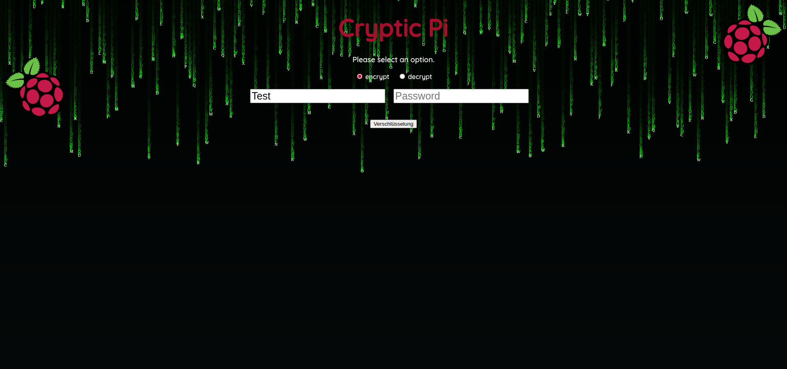

# 🔒CrypticPi - Secure Messaging App with AES Encryption 🛡️

This project implements a simple web application for encrypting and decrypting messages using AES encryption. It provides a user-friendly interface built with Flask, allowing users to enter a message and a password, then choose to encrypt or decrypt the message. The application derives an encryption key from the password using PBKDF2HMAC, ensuring secure key generation. The core functionality includes message padding, AES encryption in ECB mode, and hexadecimal representation of the ciphertext. This application solves the problem of needing a quick and easy way to encrypt and decrypt text using a password-based key.

## 🚀 Key Features

*   **Encryption:** Encrypts messages using AES with a password-derived key.
*   **Decryption:** Decrypts ciphertext back into the original message.
*   **Password-Based Key Derivation:** Uses PBKDF2HMAC for secure key generation from passwords.
*   **AES Encryption:** Employs AES in ECB mode for encryption and decryption.
*   **Padding:** Uses PKCS7 padding to ensure proper block alignment for encryption.
*   **Web Interface:** Provides a simple web interface for easy interaction.
*   **Serial Communication:** Sends and receives data from a serial device (e.g., Arduino).
*   **Configuration File:** Stores the encryption password (though currently not utilized in the `app.py`).

## 🛠️ Tech Stack

*   **Frontend:** HTML (`index.html` and `ergebnis.html`)
*   **Backend:** Python, Flask
*   **Cryptography:** `cryptography` library (AES, PBKDF2HMAC)
*   **Serial Communication:** `pyserial` library

## 📦 Getting Started / Setup Instructions

### Prerequisites

*   Python 3.6 or higher
*   `pip` package installer

### Installation

1.  **Clone the repository:**

    ```bash
    git clone https://github.com/Nino678190/CrypticPi.git
    cd CrypticPi
    ```

2.  **Install the required Python packages:**

    ```bash
    pip install flask cryptography pyserial
    ```

### Running Locally

1.  **Run the Flask application:**

    ```bash
    python app.py
    ```

2.  **Open your web browser and navigate to `http://127.0.0.1:5000/`** (or the address shown in the console output).

3.  **To run the serial communication script:**

    ```bash
    python script.py
    ```

    *Note: Ensure a serial device is connected to `/dev/ttyUSB0`.*

## 📂 Project Structure

```
├── app.py          # Flask application for encryption/decryption
├── script.py       # Script for serial communication
├── config.json     # Configuration file (encryption password)
├── templates/      # Directory for HTML templates
│   ├── index.html    # Main page with input form
│   └── ergebnis.html # Page to display results
└── README.md       # This file
```

## 💻 Usage

1.  **Web Application:**
    *   Open the web application in your browser.
    *   Enter the message you want to encrypt or decrypt in the "Message" field.
    *   Enter the password in the "Password" field.
    *   Select "Encrypt" or "Decrypt".
    *   Click the "Send" button.
    *   The result (ciphertext or plaintext) will be displayed on the `ergebnis.html` page.

2.  **Serial Communication:**
    *   Connect a serial device (e.g., Arduino) to your computer via USB.
    *   Run the `script.py` file.
    *   The script will send "hello" to the device and print the response received from the device.

## 📸 Screenshots



## 🤝 Contributing

Contributions are welcome! Please follow these steps:

1.  Fork the repository.
2.  Create a new branch for your feature or bug fix.
3.  Make your changes and commit them with descriptive messages.
4.  Submit a pull request.

## 📝 License

This project is licensed under the [GNU GENERAL PUBLIC LICENSE](LICENSE).


## 💖 Thanks

Thank you for checking out this project! I hope it's helpful.

This README is written by [readme.ai](https://readme-generator-phi.vercel.app/), your go-to platform for generating beautiful and informative README files.
